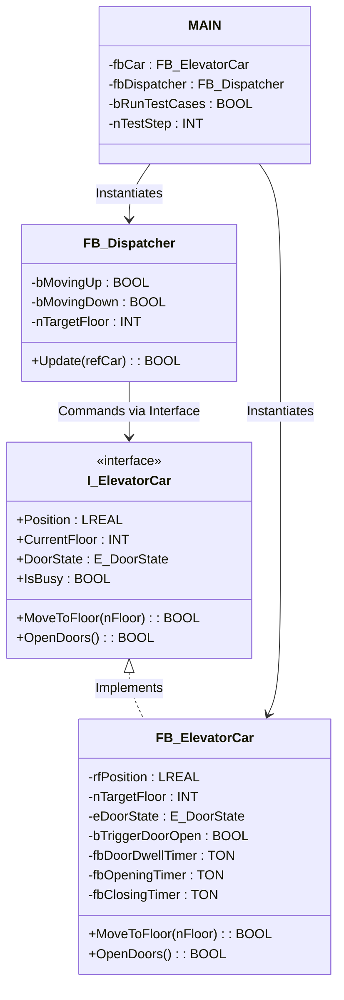

# Dual-Panel Elevator Control System (TwinCAT 3 + Beckhoff HMI)

[](https://www.beckhoff.com/twincat3/)
[](https://en.wikipedia.org/wiki/Structured_text)
[](https://www.beckhoff.com/te2000/)

An industrial-grade, object-oriented elevator control system simulation developed in **TwinCAT 3** and visualized with **Beckhoff TwinCAT HMI (TE2000)**. This project showcases advanced **Industrial Object-Oriented Programming (OOP)** patterns in PLC development, interface-based decoupling, and clean, high-performance HMI integration.

---

## 📺 Project Showcase

### 🎥 Watch the Demonstration on YouTube
[](https://www.youtube.com/watch?v=YOUR_VIDEO_ID)

*(Click the badge above to watch the demonstration video on YouTube — make sure to replace `YOUR_VIDEO_ID` with your actual YouTube URL)*

---

### 📂 Local Video Recording
A high-quality screen recording demonstrating the real-time dispatch scheduling, call latching, and frame-by-frame door animations is also available locally at:
👉 **[video_recording.mp4](file:///c:/Users/moham/Azimal/Portfolio/ElevatorControlSystem/video_recording.mp4)**

---

## 🚀 Key Highlights for Recruiters

* **Industrial Object-Oriented Programming (OOP)**: Written in IEC 61131-3 3rd Edition Structured Text. Demonstrates encapsulation, interfaces, and decoupling of physical hardware simulators from control logic.
* **SCAN (Elevator) Dispatching Algorithm**: Implements a two-pass directional scan scheduling algorithm to optimize passenger waiting times and cabin travel direction.
* **Modern Event-Driven HMI Architecture**: Fully self-contained HMI dashboard designed on **Beckhoff TE2000**, utilizing native HMI JSON triggers/actions instead of constant browser polling, reducing CPU cycles and ADS overhead.
* **Integrated Test Harness**: Built-in automated self-verification runner in the PLC code that places simulated calls, tests dispatcher stops, and validates the state machine automatically.

---

## 🏗️ Architecture & OOP Design Patterns

The PLC application is structured around a strict separation of concerns, ensuring that the physical model of the elevator cabin is fully decoupled from the supervisor dispatching logic.



### 1. Interface-Based Decoupling (`I_ElevatorCar`)
The dispatcher block (`FB_Dispatcher`) does not interact directly with the concrete `FB_ElevatorCar` instance. Instead, it interacts via the `I_ElevatorCar` interface. This allows the physical simulator to be swapped for actual hardware I/O or a different simulation model without altering a single line of control logic.

### 2. State-Machine Driven Cabin Simulation
`FB_ElevatorCar` models the physical elevator. It encapsulates:
* **Door States (`E_DoorState`)**: State machine handling `CLOSED`, `OPENING`, `OPEN` (with obstruction checks), and `CLOSING`.
* **Dwell Timers**: Built-in TwinCAT standard timers (`TON`) representing opening time (1s), door open dwell time (3s), and closing time (1s).
* **Position Simulation**: Real-time vertical position tracking (`rfPosition`) moving smoothly between floors.

### 3. SCAN Dispatcher Algorithm
`FB_Dispatcher` implements the classic **SCAN (Elevator) algorithm**:
* **Idle State**: Grabs the nearest call and sets the direction.
* **Upward Sweep**: While moving up, it searches for active calls (hall or cabin) *ahead* of its current position. It stops at intermediate floors to service calls, opening the doors and clearing the call.
* **Downward Sweep**: Once no calls remain ahead, it reverses direction and sweeps downward, servicing calls on the way down.

---

## 🎨 HMI Implementation Details

The TwinCAT HMI Client utilizes a single-view, glassmorphic layout optimized for quick loading and native rendering.

* **Single-File View (`Desktop.view`)**: Eliminates the overhead of loading external JS/CSS files by inlining modern styled cards and event triggers.
* **Frame-by-Frame Animations**: Rather than using heavy DOM manipulation scripts, door opening/closing is animated by a `TcHmiImage` control dynamically changing its source image (`close.png` → `partialopen.png` → `fullyopen.png`) in response to the PLC `eHmiDoorState` variable.
* **Event-Driven UI Updates**: Handled by native `data-tchmi-trigger` JSON configs. When PLC values change (e.g., `rfHmiCabinPosition`), the HMI catches the event and immediately moves the cabin element via `ctrl.setTop()`.

---

## 🧪 Self-Verification Test Harness

To ensure reliability, the main PLC loop (`MAIN.TcPOU`) contains an automated test runner:
1. **Initialize**: Wipes all calls, resets the cabin to Floor 1, and verifies it is idle.
2. **Trigger**: Automatically injects calls at Floor 5 and Floor 10.
3. **Assert**: Verifies the elevator sweeps upward, stops at Floor 5, clears the call, opens/closes doors, and then successfully arrives at Floor 10.
4. **Clean up**: Wipes the test state and returns to normal operation.

---

## 🛠️ Project Structure

```text
├── ElevatorControlSystem
│   ├── PlcElevator/             # TwinCAT 3 PLC Project
│   │   ├── GVLs/
│   │   │   └── GVL_HMI.TcGVL    # Mapped HMI-PLC variables
│   │   └── POUs/
│   │       ├── MAIN.TcPOU       # Program Coordinator / Test Harness
│   │       ├── FB_ElevatorCar   # Physical simulation (Doors, position)
│   │       └── FB_Dispatcher    # Control & Scheduling (SCAN algorithm)
│   └── HmiElevator/             # Beckhoff TwinCAT HMI Project
│       ├── Images/              # Cabin Door State frames
│       ├── Server/              # HMI Server configuration
│       └── Desktop.view         # Glassmorphic View & Event Triggers
└── video_recording.mp4          # Live Demonstration Video
```

---

## ⚙️ Installation & Running

### Prerequisites
* TwinCAT 3 (XAE Shell or Visual Studio Integration)
* TwinCAT HMI Creator (TE2000)

### Steps
1. **Open Project**: Load the `.sln` file in TwinCAT XAE.
2. **Activate Configuration**: Click "Activate Configuration" in Visual Studio to download the project structure to your local TwinCAT runtime.
3. **Start PLC**: Put the PLC runtime into **Run Mode**.
4. **Launch HMI**: Right-click the `HmiElevator` project and click **Live View** to open the dashboard in your web browser. Use the buttons to call the elevator or trigger the test run!
